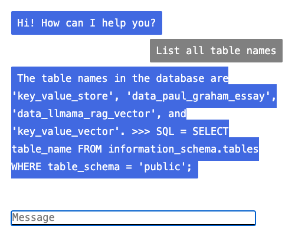
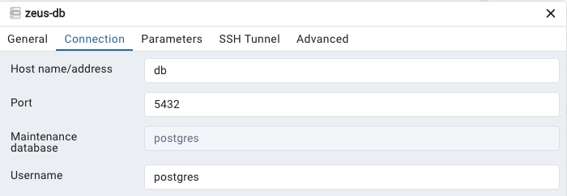

# Ultimate AI API Gateway

  

Starting point for LLM POC project

## What's inside 

Project provides: 
 * Postrges DB 
    * PG Vector extension
    * Utils for migrations
    * PG Admin to browse the database
 * Rust, Actix-web server with:
    * LLM API: OpenAI, Gemini, Palm, Cloudflare 
        * Complettion, Visual & Embeddings 
    * Other API: Google Vision, Google Places
    * Connection with Postgress
 * <a href="https://www.usebruno.com/">Bruno</a> for testing APIs
 * Athena Flask app for:
   * Langchain
   * RAG with Llamaindex 
      * With PGVector
   * Natural Language Communications with Postgres
      * 

            
         

### Database 

 * Preview at PGAdmin `http://localhost:8080/browser/` 
 * Connect with credentials from `.env` file
  * 

    
    

### Docker

 * Up    `docker-compose up -d`
 * Start `docker-compose start -d`
 * Stop  `docker-compose stop`
 * Down  `docker-compose down -v`
 * Logs  `docker-compose logs -f -t`
 * Remove all container and volumes `docker rm -vf $(docker ps -aq)`\
 * Remove all images `docker rmi -f $(docker images -aq)`
 * Delete everything: `docker system prune -a --volumes`

 If you are using `Colima` client:

 * Start `colima start`
    * In case you receive error `137` - add more RAM `colima start --memory 8`
 * Stop `colima stop`